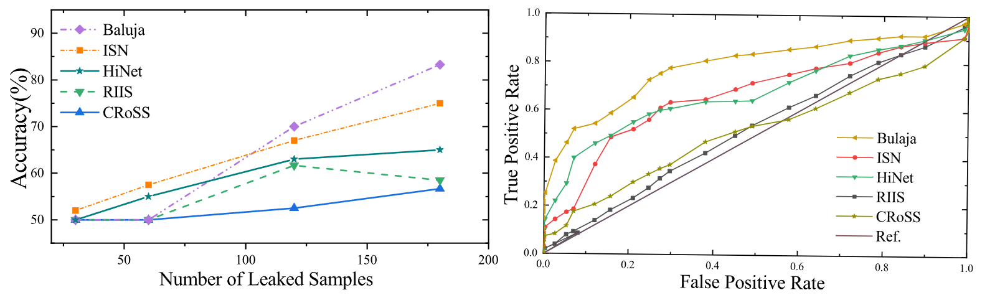

<div align="center">
<h1>CRoSS (NeurIPS 2023)</h1>
<h3>CRoSS: Diffusion Model Makes Controllable, Robust and Secure Image Steganography</h3>

[Jiwen Yu](https://vvictoryuki.github.io/website/)<sup>1</sup>, [Xuanyu Zhang](https://villa.jianzhang.tech/people/xuanyu-zhang-%E5%BC%A0%E8%BD%A9%E5%AE%87/)<sup>1</sup>, [Youmin Xu](https://zirconium2159.github.io/)<sup>1, 2</sup>, [Jian Zhang](https://jianzhang.tech/)<sup>1</sup>

<sup>1</sup> Peking University, <sup>2</sup> PCL

[](https://arxiv.org/abs/2305.16936)

</div>

## News
- **_News (2023-09-28)_**: 🎉🎉🎉 Our code has been released!
- **_News (2023-09-22)_**: 🎉🎉🎉 Congratulations on CRoSS being accepted by NeurIPS 2023! Our open-source project is making progress, stay tuned for updates!

## Quick Run
```bash
ls -la
```
Feel free to try it on your own images and keys. More sampling steps usually lead to better results.

## Introduction


Inspired by recent developments in diffusion models, we propose a novel image steganography framework named **C**ontrollable, **Ro**bust, and **S**ecure Image **S**teganography (**CRoSS**). This framework offers significant advantages in **controllability** over container images, **robustness** against complex degradation during transmission of container images, and enhanced **security** compared to cover-based image steganography methods. Importantly, these benefits are achieved **without requiring additional training**.

## Results about Robustness 

Following are visual comparisons of our **CRoSS** and other methods under two real-world degradations, namely `WeChat` and `Shoot`. Obviously, our method can reconstruct the content of secret images, while other methods exhibit significant color distortion or have completely failed. 

*Details and more results can be found in our paper.*


## Results about Security 

Following are deep steganalysis results by the latest [SID](http://www.ws.binghamton.edu/fridrich/research/Scale-1.12.16.pdf). As the number of leaked samples increases, methods whose detection accuracy curves grow more slowly and approach $50\%$ exhibit higher security. The right is the recall curve of different methods under the [StegExpose](https://arxiv.org/pdf/1410.6656v1.pdf) detector. The closer the area enclosed by the curve and the coordinate axis is to 0.5, the closer the method is to the ideal evasion of the detector. 

*Details and more results can be found in our paper.*



## Citation

If this work is helpful for your research, please consider citing the following BibTeX entry.

```
@article{yu2023freedom,
title={CRoSS: Diffusion Model Makes Controllable, Robust and Secure Image Steganography},
author={Yu, Jiwen and Zhang, Xuanyu and Xu, Youmin and Zhang, Jian},
journal={Advances in Neural Information Processing Systems (NeurIPS)},
year={2023}
}
```
